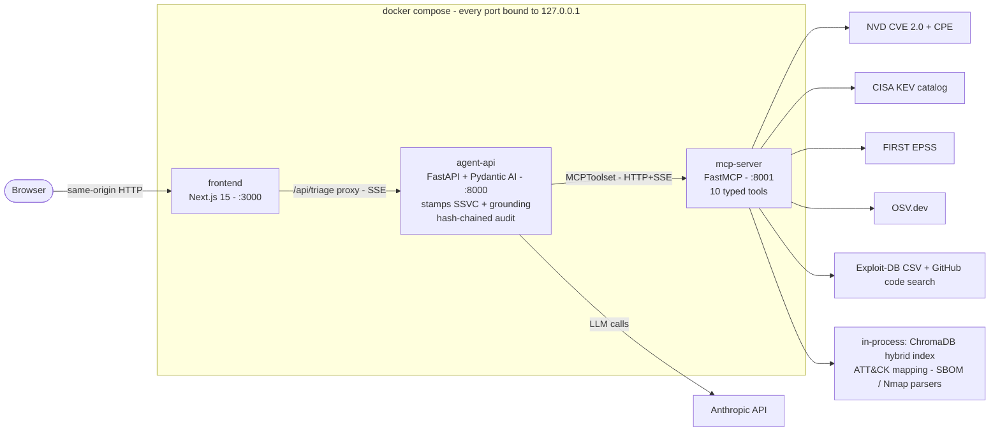
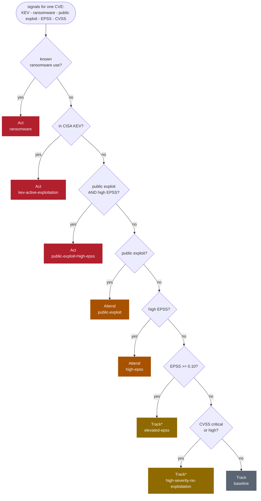

# sec-recon-agent

[](https://github.com/Shurtug4l/sec-recon-agent/actions/workflows/ci-backend.yml)
[](https://github.com/Shurtug4l/sec-recon-agent/actions/workflows/ci-frontend.yml)
[](https://www.python.org/)
[](#license)
[](SCORECARD.md)
[](https://shurtug4l.github.io/sec-recon-agent/)

**An LLM vulnerability-triage agent designed the way an AI Solutions Architect would build it and an AI Security Engineer would attack it.** Built on Pydantic AI + a custom Model Context Protocol (MCP) server, behind a Next.js frontend.

- **Grounded** - every answer is built from live authoritative feeds (NVD, CISA KEV, FIRST EPSS, OSV.dev, Exploit-DB) through ten typed MCP tools, into a schema-bounded `TriageReport`.
- **Deterministic where it matters** - the prioritization verdict (SSVC) is computed server-side from the collected signals and stamped onto the report, never LLM-guessed.
- **Verified, not just instructed** - after every run a server-side verifier re-checks each tool-derived claim in the report against what the tools actually returned.
- **Adversary-aware** - the untrusted-data boundary is a first-class design concern, exercised by a falsifiable 18-payload red-team battery and sealed into a hash-chained audit trail.


**[Try the live demo](https://shurtug4l.github.io/sec-recon-agent/)** - it replays real captured triages across the full SSVC ladder right in the browser, with a reproducible [scorecard](https://shurtug4l.github.io/sec-recon-agent/scorecard/). No API key, no setup: the runs are genuine captures, not mock data.

**In:** a CVE ID, a product version, a fuzzy description, raw Nmap XML, or an SBOM (a machine-readable software inventory: CycloneDX, SPDX, or requirements.txt).
**Out:** a schema-validated `TriageReport` - severity, exploit availability, KEV / EPSS / ransomware signals, a deterministic SSVC verdict, a recommended action with the concrete fixed version when one exists, per-feed signal coverage, and the full reasoning chain.

The signals are named and sourced: CISA KEV is the US government catalog of vulnerabilities confirmed exploited in the wild, EPSS is FIRST.org's estimated probability of exploitation within 30 days, CVSS is the standard 0-10 severity score. Coverage is honest: each feed is reported per triage as found, no entry, errored, or not queried - the report never papers over a feed it could not reach.

## Architecture



Three processes, one trust design: the browser only ever sees `:3000` (no CORS opened on the backend), the Next.js route proxies the SSE stream byte-for-byte, and the agent API stamps the deterministic verdict, the grounding assessment, and the audit row after the model returns. For one named CVE, five tools fan out in parallel; `attack_mapping` runs once at the end on the union of CWE IDs; `cve_semantic_search` runs only when the input is a fuzzy description rather than a CVE ID. Every free-text vendor field crossing a tool boundary is fenced as `<UNTRUSTED_CONTENT>` before it reaches the LLM. The full sequence diagram and the field-level trust map are in [docs/design.md](docs/design.md#triage-end-to-end); the trust boundary is the subject of [docs/case_study.md](docs/case_study.md).

## The verdict is deterministic

Prioritization follows SSVC (Stakeholder-Specific Vulnerability Categorization, CISA's decision framework), a four-step urgency ladder: **Act / Attend / Track\* / Track**, where Track\* is Track with closer monitoring. The verdict is a pure server-side function (`agent/ssvc.py`) of the signals the tools collected - same signals in, same verdict out. The LLM echoes the decision in prose; it cannot change it.



Rules are evaluated most-urgent first; the first match wins, and each outcome carries the stable rule id shown above, recorded on the report and in the audit trail together with the driving CVE (the report-level verdict is the most urgent per-CVE decision). High EPSS means probability >= 0.5 or percentile >= 0.95. Scope honesty: this is SSVC-informed, not a certified implementation - deployment-specific mission context is out of scope for a stateless tool, and the module docstring says so.

## What it is, and what it is not

Deciding whether a CVE deserves an all-hands response or a slot in next sprint is judgment work, done today across ten browser tabs: NVD for the CVSS, CISA KEV for active exploitation, FIRST EPSS for probability, Exploit-DB and GitHub for public PoCs. A general-purpose LLM goes faster and confidently hands you a CVSS that does not exist. This agent runs the entire fusion across live feeds in under two minutes and returns a deterministic verdict with a hash-chained audit of exactly how it got there. Who it is for:

- **vulnerability / AppSec engineers** - a defensible, prioritized queue instead of tab archaeology;
- **SOC engineers** - every report pivots CWE weakness classes into ATT&CK techniques, the language detections are written in;
- **teams building or vetting LLM agents** - a working reference for a grounded, type-safe, adversary-aware agent.

It is deliberately **not**:

- **not a vulnerability scanner** - it does not enumerate your packages or images; feed it an SBOM (pair it with Trivy / Grype, which produce that SBOM);
- **not a findings-management platform** - no dedup / ticketing / dashboards at fleet scale (that is DefectDojo's job);
- **not a source of ground truth** - it cites NVD / KEV / EPSS / OSV and refuses to invent facts on tool failure (degraded mode);
- **not production multi-tenant SaaS** - single-tenant by design; auth and rate-limit are opt-in.

| | **sec-recon-agent** | Trivy / Grype | DefectDojo |
|---|---|---|---|
| Primary job | Reason over a vuln from mixed inputs and prioritize it | Scan images / filesystems / SBOMs for known-vuln packages | Aggregate and manage findings from many scanners |
| Output | Grounded `TriageReport` + deterministic SSVC verdict | List of vulnerable packages + fixed versions | Dashboards, dedup, workflow / tickets |
| Signal fusion | KEV + EPSS + exploit + ransomware + ATT&CK in one verdict | CVSS / severity from the advisory | whatever the wired scanners emit |
| Adversarial posture | Untrusted-data boundary + red-team battery are first-class | trusted-input tooling | trusted-input aggregation |

## Quick start

```bash
git clone https://github.com/Shurtug4l/sec-recon-agent.git
cd sec-recon-agent
cp .env.example .env       # set ANTHROPIC_API_KEY

make build                 # multi-stage uv + node builds
make seed                  # one-shot: pull recent CRITICAL+HIGH CVEs into ChromaDB (~5-8k, 30-day window)
make up                    # start mcp-server + agent-api + frontend
make ui                    # opens http://localhost:3000
```

Prefer pulling to building? Tagged releases ship multi-arch images on GHCR with BuildKit provenance + SBOM attestations: [docs/running.md](docs/running.md#prebuilt-images-ghcr).

Three services bound to localhost only: `:3000` (Next.js frontend), `:8000` (agent API, FastAPI + SSE), `:8001` (MCP server, FastMCP). One-off query from the shell:

```bash
make triage Q="Apache 2.4.49 on port 80. Risk?"
# or: curl -N -X POST http://localhost:8000/v1/triage \
#       -H "Content-Type: application/json" -d '{"query": "Apache 2.4.49 on port 80. Risk?"}'
```

The no-Docker development path, API authentication, rate limiting, and MCP transport auth are in [docs/running.md](docs/running.md).

## The ten tools

Each tool has a typed Pydantic contract: validated input, typed result model, typed errors, size and rate caps, and untrusted-content fencing on free-text fields. Per-tool contracts with caps and retry policies are in [docs/tools.md](docs/tools.md).

| Tool | Source | Returns |
|---|---|---|
| `cve_lookup` | NVD CVE 2.0 API | `CVEDetail`: CVSS v3, severity, CWEs, affected CPEs, references |
| `cve_semantic_search` | local ChromaDB index | ranked `CVECandidate` hits for fuzzy descriptions (hybrid dense + BM25, RRF-fused) |
| `exploit_check` | Exploit-DB CSV + GitHub code search | `ExploitCheck`: public-PoC availability |
| `kev_check` | CISA KEV catalog | `KevCheck`: exploited-in-the-wild, remediation deadline, ransomware flag |
| `epss_score` | FIRST.org EPSS API | `EpssScore`: 30-day exploitation probability + percentile |
| `patch_lookup` | NVD CPE configurations | `PatchAvailability`: fixed-in versions per affected product |
| `osv_lookup` | OSV.dev API | `OsvScanResult`: advisories for a package at a specific version |
| `sbom_ingest` | local parse, no network | `SbomComponentList` from CycloneDX / SPDX / requirements.txt |
| `nmap_parse_xml` | local parse, defusedxml | `NmapScanResult`: hosts, ports, services, version banners |
| `attack_mapping` | bundled MITRE ATT&CK mapping | ATT&CK techniques + mitigations for a set of CWE IDs |

The system prompt encodes one prioritization heuristic: CISA KEV membership > known ransomware use > EPSS probability >= 0.5 (or percentile >= 0.95) > CVSS as tiebreaker. CVSS alone over-weights theoretical impact relative to real-world exploitation likelihood.

## Determinism, honesty, audit

- **Signal-coverage honesty.** Every report carries a per-feed coverage map: found, no entry, errored, or not queried. A triage that could not reach EPSS says so instead of silently omitting the signal, and the eval suite scores this honesty.
- **Grounding verification.** The no-invention contract is not just instructed, it is *checked*: a pure server-side verifier (`agent/grounding.py`) re-checks every tool-derived claim in the report - CVE identity, CVSS, KEV, EPSS, exploit and ransomware flags, ATT&CK ids - against the tool returns captured from the run's own message history, and stamps a deterministic `grounded` / `suspect` / `not_evaluated` assessment with per-claim findings onto the report and into the audit chain. The frontend renders it as a badge next to the model's self-assessed confidence, so the operator sees what was verified, not just what was asserted.
- **Hash-chained audit trail.** Every triage appends one row to an append-only SQLite log, sealed with `prev_event_hash` / `this_event_hash` over a canonical JSON serialization; `sec-recon-audit verify` walks the chain and exits non-zero on tamper, and the dashboard's audit-trail tab renders it live (`GET /v1/audit`, digest-only). Digest-only by default: plain query text stays out unless explicitly enabled. Internals in [docs/design.md](docs/design.md#operational-notes).
- **Interchange exports.** A finished report renders into SARIF 2.1.0 (GitHub code scanning) and OpenVEX v0.2.0 via `sec-recon-export` or `POST /v1/export/{sarif,openvex}`. Pure functions of the report; product identity is never guessed, so a bare-CVE triage refuses to emit VEX instead of fabricating one.
- **SBOM gate.** `sec-recon-gate` runs the same tool chain with no LLM anywhere in the loop: SBOM in, OSV advisories, KEV / EPSS / exploit enrichment, a deterministic SSVC decision per finding, and a CI exit code (`--fail-on act` by default; `--strict` also fails on enrichment coverage gaps). Reproducible, free, and injection-proof by construction - there is no prompt for a hostile SBOM to attack. Usage in [docs/running.md](docs/running.md#sbom-gate).

The gate ships as a composite GitHub Action at the repo root, and this repository dogfoods it: `ci-sbom-gate.yml` scans the project's own dependency tree on dependency changes and a weekly cron, uploads SARIF to the Security tab, and attests the SBOM + gate report on non-PR runs.

```yaml
- uses: Shurtug4l/sec-recon-agent@v0.1.0
  with:
    sbom-path: sbom.cdx.json
    fail-on: act
    github-token: ${{ github.token }}
```

## Eval, red team, scorecard

An end-to-end golden-set evaluation (`src/sec_recon_agent/eval/`) exercises the live HTTP API with 11 curated queries: named CVEs, fuzzy descriptions, an SBOM, degraded inputs. Assertions are soft (severity within +-1 step, expected CVE recall >= 0.5, KEV / ransomware flags honored) because the agent is probabilistic; the measured axes are the ones an engineering review actually asks about: latency p50/p95, tokens and $/triage, structured-output conformance, confidence calibration (ECE), and retrieval quality (hit-rate@k, MRR).

A red-team battery of 18 prompt-injection payloads across six categories (direct override, role-play, fake authority, marker forgery, system-prompt extraction, indirect injection via tool output) applies falsifiable resistance checks to the returned report, with per-MITRE-ATLAS-technique resistance rates.

```bash
make up
make eval          # golden set against the live stack; bills the LLM
make redteam       # injection battery; bills the LLM
make scorecard     # regenerate SCORECARD.md from stored result JSONs
```

Both suites are deliberately out of CI: they need a live stack and bill the LLM provider. Results land in one stamped, reproducible [SCORECARD.md](SCORECARD.md); the baseline is measured on sonnet (the default haiku is cheaper but thrashes on multi-tool cases). Full commands and the model-comparison mode are in [docs/evaluation.md](docs/evaluation.md).

What CI does gate on is the **record-replay harness**: committed cassettes (`tests/cassettes/`, one frozen real trajectory per golden case) are replayed through the deterministic pipeline - trajectory extraction, grounding verification, SSVC, golden scorer - on every PR, asserting bit-exact agreement with the recorded outcomes at zero LLM cost. A staleness hash over the LLM-visible surface hard-fails the gate when behavior-bearing text changes without re-recording (`make record-cassettes`). Details in [docs/evaluation.md](docs/evaluation.md#record-replay-gate).

## Security posture

Every HIGH finding from an independent security review is mapped to the code change that addressed it in [docs/design.md](docs/design.md#threat-model), including a diagram of where each control sits on the untrusted-data path. Highlights:

- **Strict typing at the model boundary** - every tool I/O is a Pydantic model; `mypy --strict` enforced.
- **Untrusted-content fencing** - every free-text vendor field is wrapped with `<UNTRUSTED_CONTENT>` markers at the code boundary (`mcp_server/security.py`); the system prompt instructs the LLM to treat fenced content as data, never as instructions.
- **XXE-safe XML parsing** - `defusedxml` with explicit `forbid_dtd=True`, tested against classic, external-DTD, parameter-entity, and billion-laughs payloads.
- **Bounded resource consumption** - every input crossing the MCP boundary is double-capped (schema `max_length` + runtime pre-flight); outbound feeds are host-locked with size caps and post-redirect host checks.
- **Error-payload allowlist** - the SSE `error` event surfaces a generic message unless the exception type is explicitly allowlisted; internal messages never leak to the client.
- **Container hardening** - non-root users, `read_only: true` rootfs, `no-new-privileges`, ports bound to `127.0.0.1`, `tmpfs:/tmp`.
- **Trivy in CI** - both images scanned on dependency changes plus a weekly cron; CRITICAL findings block the merge, HIGH findings land as SARIF in the Security tab. Open findings are triaged with accept rationale in [docs/security_findings.md](docs/security_findings.md).
- **SBOM gate in CI** - the repository's own dependency tree is scanned by the deterministic gate on dependency changes plus a weekly cron; an Act-grade advisory fails the run.
- **Opt-in API auth and per-IP rate limiting**; the MCP port takes a bearer token whenever it is published beyond the compose network - setup in [docs/running.md](docs/running.md).
- **Denial-of-wallet and kill-switch rails** - a per-request round cap bounds one run; an opt-in rolling-24h spend ceiling (`DENIAL_OF_WALLET_USD_PER_DAY`) bounds the aggregate an attacker can drive, and a kill-switch (env flag or a per-request sentinel file) disables `/v1/triage` with 503 live, with no redeploy. Both refuse before the agent is built, so a refused request spends nothing.
- **Opt-in egress allowlist** - a default-deny forward proxy (`make up-egress`) permits outbound HTTPS only to the known feed hosts + the LLM provider, a network-level belt under the per-feed application-level host locks: a tool coerced into a different host cannot connect.

## Testing

**566 tests (563 fast + 3 slow ChromaDB round-trip tests, excluded from the fast run)**, all network-mocked, no LLM billing. Coverage on the fast suite holds at ~90% with a soft 70% floor. CI matrix-tests Python 3.12 + 3.13.

```bash
make test                        # full suite (includes the 3 slow tests)
uv run pytest -m "not slow"      # fast suite, ~3.5 min (tenacity retry tests include real waits)
uv run pytest -m "not slow" --cov
uv run pytest tests/property     # property-based + adversarial corpus only
make lint                        # backend (ruff + mypy --strict) + frontend (ESLint)
```

The per-area breakdown - tool contracts, adversarial corpus, API, audit hash chain, eval metrics, red-team scorer, SSVC rules, observability privacy invariants - is in [docs/design.md](docs/design.md#testing-strategy).

## Frontend

The browser is the primary interface, in a dual-theme "Editorial instrument" design system (dark instrument by default, light technical paper via the header toggle). Seven tabs plus a permalink route:

- **Home (`/`)** - landing: SSVC ladder hero, design pillars, tool grid.
- **Triage (`/triage`)** - query form with example chips, live SSE progress, the report view, and a localStorage history sidebar.
- **Dashboard (`/dashboard`)** - statistics from local history, a measured per-node latency waterfall, a transparency tab showing the literal system prompt and tool inventory from `GET /v1/meta`, and an audit-trail tab that renders the tamper-evident hash chain from `GET /v1/audit` (chain-integrity status + digest-only rows).
- **Scorecard (`/scorecard`)** - the reproducible scorecard rendered as tabbed bands.
- **Case study (`/case-study`)** - the trust-boundary design narrative as a guided tour.
- **Guide (`/guide`)** - one explainer per framework the agent grounds answers in (CVE / CVSS, KEV, EPSS, SSVC, ATT&CK, ATLAS, SBOM, MCP...).
- **Docs (`/docs`)** - the full `docs/*.md` set (design, threat model, OWASP LLM Top 10, MITRE ATLAS, ISO 42001, MCP self-audit, security findings, case study) rendered and searchable in-app, each with its own section table of contents.
- **`/r`** - self-contained viewer for shared-report permalinks: the whole report is gzip-encoded in the URL fragment, decoded locally, never sent to a server.

Reports stream live over SSE, render the untrusted-content fence semantically (vendor text is visibly quarantined), surface the server-side grounding verification, and export to Markdown, raw JSON, or print-to-PDF. Component map and SSE wire protocol in [docs/frontend.md](docs/frontend.md).

## Stack

**Backend**: Python 3.12+, `uv`, `pydantic-ai`, `mcp` (FastMCP), FastAPI + `sse-starlette` + `slowapi`, ChromaDB (ONNX MiniLM embedder), `httpx` + `tenacity`, `defusedxml`, `cvss`, `pydantic-settings` (`SecretStr`), `structlog`, OpenTelemetry. **Frontend**: Next.js 15 (App Router), React 19, TypeScript, Tailwind CSS, Radix primitives, Recharts. **Containers**: multi-stage Dockerfiles, Docker Compose, optional Jaeger profile; tagged releases publish multi-arch images to GHCR with BuildKit provenance + SBOM attestations. **Tests**: pytest, respx, Hypothesis, the OpenTelemetry SDK's `InMemorySpanExporter`.

Observability: OTel tracing in both Python processes, stdout exporter by default, `make obs-up` for a Jaeger sidecar at `:16686`, W3C `traceparent` propagated from the frontend proxy through to the MCP server. Span attributes are allowlisted; user query text and vendor content are never recorded. Details in [docs/design.md](docs/design.md#observability).

## Project layout

```
sec-recon-agent/
+- src/sec_recon_agent/
|  +- agent/          # Pydantic AI agent: prompts, TriageReport schema, deterministic SSVC (ssvc.py)
|  +- api/            # FastAPI app: POST /v1/triage (SSE), /v1/meta, /v1/health, /v1/audit, /v1/export/*
|  +- audit/          # SHA-256 hash-chain audit log + sec-recon-audit CLI
|  +- eval/           # golden set, runner, scorer, metrics, cost, scorecard generator
|  +- export/         # pure SARIF 2.1.0 / OpenVEX renderers + sec-recon-export CLI
|  +- gate/           # deterministic no-LLM SBOM gate (OSV -> KEV/EPSS/exploit -> SSVC) + CLI
|  +- redteam/        # injection payloads, scorer, CLI
|  +- mcp_server/     # FastMCP server: 10 tools + models, errors, security, auth, nvd_client
|  +- config.py, observability.py
+- frontend/          # Next.js 15 App Router, dual-theme editorial-instrument design system
+- tests/             # agent, api, audit, eval, mcp_server, property, redteam, replay, observability
|  +- cassettes/      # frozen real trajectories replayed as the CI gate (make record-cassettes)
+- docs/              # design, case study, tools, evaluation, running, frontend, governance mappings
+- examples/          # real agent sessions captured live
+- scripts/           # demo fixture capture
+- SCORECARD.md       # reproducible metrics (make scorecard)
+- Dockerfile, docker-compose.yml, Makefile, pyproject.toml, SECURITY.md, .env.example
```

## Documentation

- [docs/design.md](docs/design.md) - the engineering brief: architecture decisions with rejected alternatives, threat model with finding-to-fix mapping, defended invariants, testing strategy, operational notes.
- [docs/tools.md](docs/tools.md) - per-tool MCP contracts: inputs, result models, caps, retry policies.
- [docs/evaluation.md](docs/evaluation.md) - eval suite and red-team battery in depth: commands, sample outputs, model comparison.
- [docs/running.md](docs/running.md) - no-Docker development, API auth + rate limiting, MCP transport auth, observability endpoints.
- [docs/frontend.md](docs/frontend.md) - frontend component map, SSE wire protocol, theming, export/share.
- [SCORECARD.md](SCORECARD.md) - one reproducible, stamped scorecard across security posture, detection, retrieval, cost / latency, calibration.
- [examples/triage_walkthrough.md](examples/triage_walkthrough.md) - real agent sessions captured against the live stack.
- [CONTRIBUTING.md](CONTRIBUTING.md) - local dev setup, pre-commit, branch protection, PR flow.
- [SECURITY.md](SECURITY.md) - responsible-disclosure policy and safe-harbor terms.

For an AI security / governance reviewer, the governance set answers three questions: what risks were considered, what an attacker would do against the agent itself, and what an AIMS-certified organization would need to point at.

- [docs/case_study.md](docs/case_study.md) - the design narrative on the untrusted-data trust boundary: threat model, why the obvious defenses fail, the six-layer design, residual risk. Also ships as an [interactive tour in the demo](https://shurtug4l.github.io/sec-recon-agent/case-study/).
- [docs/owasp_llm_top10.md](docs/owasp_llm_top10.md) - OWASP LLM Top 10 (2025) mapping with status, controls, file:line citations, and the tests defending each invariant.
- [docs/mitre_atlas.md](docs/mitre_atlas.md) - MITRE ATLAS mapping (AI-specific adversary tactics and techniques).
- [docs/iso_42001.md](docs/iso_42001.md) - ISO/IEC 42001:2023 alignment matrix with explicit out-of-scope declarations.
- [docs/mcp_self_audit.md](docs/mcp_self_audit.md) - the MCP server audited as a plugin surface against OWASP LLM07 / LLM08 and MCP anti-patterns.
- [docs/security_findings.md](docs/security_findings.md) - open Trivy / SARIF findings with triage notes and accept rationale.

## License

MIT.
